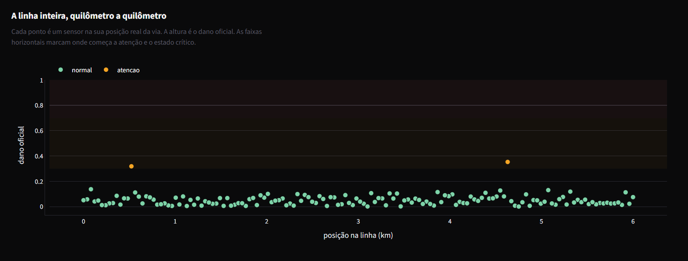

<div align="center">

# Predictive Catenary Monitoring

**From the AutoCAD drafting table to the sensor: structural fatigue monitoring for railway catenary networks.**

A concurrent ingestion gateway in Go receiving telemetry from thousands of
simultaneous sensor points, feeding a Python analysis engine that combines
mechanical vibration with a simplified structural fatigue model to predict
failure points before they happen.

[](https://go.dev)
[](https://www.python.org)
[](https://streamlit.io)
[](https://supabase.com)

`Under development`

[Português](README.md) &nbsp;·&nbsp; **English**

</div>

---

## Why this project

Before I got into programming, I spent 6 months at Systra, a multinational
railway engineering firm, working on infrastructure projects for the São
Paulo Intercity Train (TIC). During that time I produced technical drawings
and control schematics for catenary systems in AutoCAD, the suspended cable
above the track that delivers power to the train through contact with the
pantograph.

Catenary is critical infrastructure under constant mechanical stress:
tension load, vibration from train passage, thermal variation, contact wear.
A failure builds up silently, through fatigue cycles over months, until it
breaks without warning. This project takes the problem I used to see represented as a
floor plan and turns it into the real software engineering problem behind
it: how would a system need to be designed to capture that in real time,
at the scale of thousands of sensor points across an entire line, without
dropping data under load.

This has no ambition of becoming a certified structural engineering
product. The point is to show that I can design the data pipeline a real
railway infrastructure problem would require, from sensor to decision.

---

## The problem, formulated as engineering

> Input: continuous vibration readings from thousands of sensor points along
> the catenary network. Output: a risk classification per point (normal,
> attention, critical), updated in real time, with no ingestion bottleneck
> even under spikes of thousands of messages per second.

Computing fatigue is the easy part. What most academic prototypes ignore is
the systems problem hiding behind it: **ingestion concurrency at scale**. A
single-threaded Python scraper reading sensors one at a time cannot handle
an entire railway line. That is where the language choice stops being
aesthetic and becomes an engineering decision.

---

## Architecture

```
thousands of sensors (simulated)
        │  publish vibration readings
        ▼
┌───────────────────────┐
│   Ingestion Gateway      │  Go, one goroutine per sensor connection,
│         (Go)             │  concurrent aggregation via channels
└───────────┬─────────────┘
            │  aggregated batches
            ▼
┌───────────────────────┐
│    Analysis Engine        │  Python, FFT of the vibration signal,
│      (Python)             │  fatigue accumulation model (simplified
│                           │  Basquin rule), risk classification
└───────────┬─────────────┘
            │  readings + alerts
            ▼
┌───────────────────────┐
│      Supabase              │  Postgres, reading history, alerts,
│    (Postgres)             │  registered sensor points
└───────────┬─────────────┘
            │
            ▼
┌───────────────────────┐
│      Dashboard               │  Streamlit, line map, critical point
│      (Streamlit)            │  ranking, vibration time series
└───────────────────────┘
```

| Layer | Language | Why this choice |
|---|---|---|
| Ingestion gateway | **Go** | Thousands of sensors publishing simultaneously is a concurrency problem, not a compute problem. Goroutines handle thousands of simultaneous connections at a fraction of the memory cost of traditional threads, and channels give a safe way to aggregate readings from multiple goroutines without locks scattered through the code. If this gateway were written in Python, the GIL would become the bottleneck exactly when it matters most, traffic spikes. |
| Analysis engine | **Python** (NumPy, SciPy) | Vibration spectral analysis and the fatigue model are computation, not concurrent I/O. This is where Python's scientific library density pays off, without the overhead of writing linear algebra by hand in Go. |
| Persistence | **Supabase** (Postgres) | Same stack already used in production elsewhere in this portfolio. Reading history becomes one table, alerts another, with a direct relationship between them. |
| Visualization | **Streamlit** | Fast dashboard prototyping without hand-writing a frontend, the same choice made in the other two projects of this portfolio. |

---

## The gateway, load tested

`go build ./... && go vet ./...` pass clean, but that only proves the code
compiles, not that the concurrency architecture holds up to what the
README promises. That is why the project includes `cmd/gerador_carga`, a
tool that opens thousands of real TCP connections against the gateway and
measures the result, instead of just stating a number.

```bash
go run ./cmd/gateway --porta :9000
go run ./cmd/gerador_carga --sensores 2000 --alvo 127.0.0.1:9000 --duracao 10s
```

**Measured result:** 2,000 simulated sensors, connected concurrently, each
sending one reading per second. Zero connection failures, 16,000 readings
delivered, a peak of 2,000 simultaneously active TCP connections on the
gateway, confirmed by the server's own stats log.

### Two real problems the load test uncovered

The first version of the load test never got there, it failed on 1,381 of
2,000 connections. The gateway itself was never the problem, both bugs
were in the load generator:

**1. `localhost` resolves to IPv6 first on Windows.** Name resolution
preferred `::1`, and a large share of connection attempts got "connection
actively refused" even with the gateway running normally. Fixed by using
explicit `127.0.0.1` instead of `localhost`.

**2. Firing 2,000 dials at the same instant overflows the operating
system's pending connection backlog.** This is not a gateway limit (the
goroutines handle it fine), it is the local TCP stack receiving SYNs
faster than it can queue them. The fix was not just technical, it was also
more realistic: real sensors do not connect at the exact same microsecond
either. `cmd/gerador_carga` now spreads connection opening across a
configurable window (`--janela-conexao`, 3s by default) and retries with a
short backoff before giving up, the same behavior a real sensor would have
after a dropped SYN.

---

## The fatigue model

### The physical phenomenon

Fatigue is structural degradation under cyclic loading: forces that rise
and fall repeatedly. Even when each cycle stays well below the material's
rupture limit, repetition creates microfractures that propagate over time
until the part can no longer carry the load, and the rupture happens
suddenly, not gradually. That is what makes fatigue dangerous: the cable
can look intact right up to the exact cycle it breaks on.

### The Basquin rule: how many cycles to failure

Proposed by O. H. Basquin in 1910, it describes the relationship between
cyclic stress amplitude and the number of cycles a material withstands
before failing, in the elastic regime (no visible plastic deformation):

$$\sigma_a = \sigma'_f \, (2N_f)^b$$

| Symbol | Meaning |
|---|---|
| $\sigma_a$ | cyclic stress amplitude |
| $\sigma'_f$ | material's fatigue strength coefficient (from real test data) |
| $N_f$ | number of cycles to failure |
| $b$ | Basquin exponent, negative, the slope of the curve on a log-log scale |

### The Palmgren-Miner rule: summing variable-amplitude cycles

Basquin alone only answers the right question for constant stress. A real
catenary cable experiences variable stress: a wind gust produces strong
cycles, a breeze produces weak ones. Palmgren (1924) and Miner (1945),
independently, proposed that damage is linear, cumulative and
irreversible: each cycle consumes a fraction of the fatigue life, and
failure happens when those fractions add up to 1:

$$D = \sum_{i=1}^{k} \frac{n_i}{N_i} \qquad \text{failure when } D \geq 1$$

Where $n_i$ is how many cycles happened at stress level $i$, and $N_i$ is
how many cycles that stress level would withstand before failing (Basquin
answers that).

### How this becomes code

| Theory symbol | Where it lives in `sensor.py` |
|---|---|
| $\sigma_a$ | `amplitude_tensao_n`, the stress peak of each simulated train passage |
| $\sigma'_f$ | `TENSAO_REFERENCIA_N` |
| $b$ (in the form $N_f = (\sigma_a/\sigma'_f)^{1/b}$) | `EXPOENTE_BASQUIN`, with $1/b = -\text{EXPOENTE}\_\text{BASQUIN}$ |
| $N_i$ | `ciclos_ate_falha`, computed at every passage from that specific cycle's amplitude |
| a single cycle's $n_i/N_i$ | `dano_por_ciclo = (1.0 / ciclos_ate_falha) * self.taxa_desgaste` |
| $D = \sum n_i/N_i$ | `self._dano_acumulado`, summed on every call to `registrar_passagem_de_trem` |
| $D \geq 1$ | `dano_acumulado >= LIMIAR_CRITICO` (0.7, not 1.0, on purpose: the alert fires before the theoretical failure point, with a safety margin) |

`taxa_desgaste` is an extension beyond classic theory: a per-sensor
multiplier simulating variance in material quality or
installation between different points on the same line. Without it, every
sensor would follow the same damage trajectory, and there would be nothing
for the next phase's analysis engine to learn to tell apart.

### The honest caveat

The chosen exponent (`EXPOENTE_BASQUIN = 6.0`, equivalent to $b \approx
-0.167$) is much more aggressive than typical real metal values ($b$
between $-0.05$ and $-0.12$). The choice is deliberate: with a realistic
$b$, the simulation would take entire days of real time to accumulate
visible damage. With the current exponent, damage evolves in minutes, fast
enough to test and demonstrate the whole pipeline in one work session.
$\sigma'_f$ is also an example value, not from real catenary cable material
test data. The code also simplifies the conversion between reversals and
cycles ($2N_f$ in the original formula becomes $N_f$ directly), with no
impact on the accumulation logic, only on the absolute scale of the number.

**This does not replace a certified structural analysis.** The final
number the model spits out matters less than the architecture that
produces it. The ingestion, processing and decision pipeline is the same
shape a real monitoring system would use: sensors measure stress cycles,
Basquin estimates how many cycles that level withstands, Miner sums the
historical damage, and a threshold fires the alert before failure. Only
the material behind the numbers is an example, not the logic that
processes them.

In a certified version, the illustrative values here would come from
specific technical standards, not free choice: Brazil's ABNT NBR 8800
covers fatigue verification and allowable-cycle tables for steel
structures; NBR 5422 governs the mechanical design of suspended overhead
cables under wind, ice and temperature; and NBR 13982 specifies the wind
vibration test on cables that produces $b$ and $\sigma'_f$ in the lab,
the two parameters this project assumes as an example. For railway
catenary specifically, the Brazilian industry uses the AREMA manual
alongside NBR 8800, since there is no dedicated NBR for that case.

### How accelerated the accelerated regime is, measured

The real published numbers I found (not specific to copper/copper-silver
contact wire, which sits behind a paywall, but general enough to give an
order of magnitude): real contact wire mechanical tension between 15 and
30 kN depending on the line's speed class, and Basquin exponent $b$
between $-0.05$ and $-0.12$ for metals in general. That became
`TENSAO_REFERENCIA_REAL_N` and `EXPOENTE_BASQUIN_REAL` in
`src/simulador/sensor.py`, each source cited in the code, alongside the
accelerated values that remain the default.

`scripts/comparar_regime_real.py` runs the same physics (same
`registrar_passagem_de_trem`, same Basquin/Miner rule) with both sets of
constants and measures how many train passages each regime needs to
cross the critical threshold:

| Regime | Passages to critical | At 120 trains/day |
|---|---:|---:|
| Accelerated (demo) | 42 | 0.3 days |
| Real (cited) | 15,291 | **127 days (~4 months)** |

**Acceleration factor: 364x.** The real regime's number lands in the
right ballpark for real railway infrastructure fatigue (months to years,
not minutes), which gives a bit more confidence that the model's physics
is qualitatively sound even with example parameters. It is still not a
validation (the exact real-material $\sigma'_f$/$b$ are missing, behind a
paywall), but it is the difference between "made-up number" and "number
aligned with the published order of magnitude."

---

## The analysis engine

The engine consumes what the gateway publishes (one reading per line, the
same NDJSON schema the simulator produces) and decides each sensor's risk
two independent ways, never reading the `dano_acumulado` field the
simulator already knows:

**1. By cycles (Basquin/Miner), replicated from raw stress.**
`src/analise/fadiga.py` reimplements the same rule as the simulator, but
without knowing the cable's resting stress ahead of time, because no real
sensor would. The baseline is estimated online: readings close to the
recent value slowly update the baseline, sharp jumps above 1500N count as
a passage cycle and feed Basquin.

**2. By spectral analysis (FFT), from raw vibration.** The vibration
signal sums a marked structural oscillation, the 60Hz traction network
coupling, and broadband noise whose intensity grows with wear.
`src/analise/espectro.py` separates the two known peaks from the rest of
the spectrum via `numpy.fft.rfft`, and uses the remaining power (the
noise floor) as an independent damage signal.

### A real modeling bug, found testing the actual pipeline

The first version of the spectral estimator looked like it worked:
calibrated and validated isolating fixed base stress and temperature, the
mean error sat at 0.06. Running through the full pipeline, with base
stress and temperature varying per sensor the way the real network
produces, error jumped to 0.13, roughly constant regardless of true
damage, a sign of systematic bias, not noise.

The cause: the original model fit a **straight line** between spectral
power and damage. Physically wrong. Power is the square of an amplitude,
and it is the noise's **standard deviation** that grows linearly with
damage (`intensidade_ruido = RUIDO_BASE + RUIDO_POR_DANO * dano`, the
same formula that generates the signal in the simulator). A line fit to a
quadratic relationship works by accident in the narrow range it was
calibrated on and fails outside it, and it extrapolated to negative power
near zero damage, which was the warning sign missed in the first
validation.

The fix: `scripts/calibrar_espectro.py` now fits a single scale factor
`k` such that `piso_de_potencia ≈ k * intensidade_ruido²`, with base
stress and temperature varying alongside damage in the calibration data.
`k` comes out to **1.0127**, close to 1.0, confirming that average power
per white-noise bin is approximately equal to the process variance over
time. Not a magic number tuned until it worked, it is confirmation that
the quadratic form is the correct physics.

**Result, on the same full pipeline that previously measured 0.13 error:**

| Estimator | Mean absolute error | Source |
|---|---:|---|
| By cycles (Basquin/Miner) | **0.0018** | raw mechanical stress |
| Spectral (FFT), corrected model | **0.0021** | raw vibration |
| Spectral (FFT), original model (linear) | 0.13 | same data, wrong formula |

Tested with the full real pipeline: `simulator → TCP → Go gateway → pipe
→ analysis engine`, not isolated synthetic data.

```bash
go build -o gateway.exe ./cmd/gateway
./gateway.exe --porta :9000 | python scripts/motor_analise.py &
python scripts/simular_sensores.py --gateway 127.0.0.1:9000 --duracao-s 30
```

### The mean error was hiding the case that matters

Those two numbers above, nearly tied, suggest the estimators are
interchangeable. They are not, and the end to end persistence test showed
it the hard way: a sensor with **0.652** real damage, one step from the
0.7 critical threshold, was classified **NORMAL** and fired no alert at
all.

| | real damage | by cycles | spectral |
|---|---:|---:|---:|
| sensor with accelerated wear | 0.652 | **0.049** | 0.609 |
| the other 9 in the test | < 0.04 | error < 0.008 | error < 0.009 |

Cycle counting is **blind to accelerated wear**, and that is inherent, not
an arithmetic bug. The simulator multiplies each passage's damage by the
point's `taxa_desgaste` (2% of sensors are born with 8 to 20 times the
normal rate, simulating aged catenary or an installation defect). Counting
stress cycles there is no way to infer that factor: two points under the
same load with the same number of passages produce the same count, whether
or not they are degrading at different rates. And no real sensor would know
its own point's rate.

The spectral estimator got it right (0.609 against 0.652) because it reads
the vibration noise floor, which reflects physical damage regardless of the
rate. The project's premise held up exactly in the case it existed to
solve. The mistake was leaving the alerting decision to the blind
estimator.

**The fix,** in `src/analise/motor.py`: a sensor's state now comes from the
**larger** of the two damage values, the conservative reading for a system
whose job is to warn before failure. And the divergence between the
estimators, previously just noise, became signal: above
`LIMIAR_DIVERGENCIA` (0.15) the point is flagged as suspected accelerated
wear.

**Validated across 150 sensors, 2,850 readings:** 3 points flagged, that is
the same 2% the simulator creates defective, and they are exactly the 3
with the highest real damage in the network, with no false positives. The
official damage (the larger of the two) lands at **0.0041** mean error,
between cycle counting's 0.0063 and the spectral 0.0036, but without the
blind spot that let a sensor about to fail slip through.

### The flapping alert, and how smoothing nearly cost a detection

Running the fix above across the whole network, one of the defective
sensors entered and left the alert state three times in 19 readings
(`nnnnnnnnnnnnnnnAnnA`), firing a duplicate alert for the same point. The
cause is that `estimar_dano_espectral` measures the noise of a 1 second
window and carries that noise's variance: a sensor with damage near the
threshold crosses the line both ways on every reading. In real operation
that is alarm fatigue.

The answer is a per sensor moving average (`SuavizadorEspectral`), and the
window size came from a measured sweep, not a guess
(`scripts/calibrar_suavizacao.py`):

| windows | mean error | sensors alerted | flaps |
|---:|---:|---:|---:|
| 1 (no smoothing) | 0.0041 | 2 | 2 |
| 2 | 0.0040 | 2 | 2 |
| **3** | **0.0040** | **2** | **0** |
| 5 | 0.0044 | 1 | 0 |
| 12 | 0.0056 | 0 | 0 |

The first guess had been 5, and the sweep showed 5 **loses a defective
sensor**: the average dilutes the noise peak below the threshold. At 12 the
engine alerts on nobody. 3 is the smallest value that zeroes the flapping
and, as it happens, also the lowest error.

**The side effect smoothing brought.** Smoothing compresses exactly the
peaks that reveal accelerated wear. The weakest defective sensor's peak
divergence dropped from 0.188 to 0.069, brushing against the healthy ones
(0.066), and it stopped being flagged. The fix was to use the spectral
signal two ways according to what each needs: **state** comes from the
smoothed value, which wants stability, and **divergence** is measured on
the raw value, which wants sensitivity. On the raw signal that sensor sits
at 0.188 against 0.059 for the worst healthy one, a comfortable margin.

**Final result on the 150 sensor network:** 2 state changes in total, that
is exactly the two legitimate transitions and no flapping, all 3 defective
points flagged, and **0.0040** error on the official damage, the best among
every configuration tested.

### RUL and SNR: two more metrics, no new sensor invented

Beyond raw damage, the engine now computes two metrics common in real
predictive maintenance, reusing what is already computed on every
reading:

**Remaining Useful Life (RUL).** `AcumuladorDano`
(`src/analise/fadiga.py`) now receives each reading's timestamp and
linearly extrapolates the mean damage accumulation rate since that
sensor's first reading to estimate how long until it crosses
`LIMIAR_CRITICO`. It is a simple extrapolation, not a regime-change-robust
regression, and the code documents that limitation explicitly: it assumes
the wear pace observed so far continues unchanged.

**SNR (signal-to-noise ratio).** The engine already separates the two
known spectrum peaks (18Hz structural, 60Hz grid) from the rest to
compute spectral damage. SNR (`src/analise/espectro.py:estimar_snr_db`)
reads the same separation from the other side: peak power over noise
floor power, in dB. It serves as an independent signal-quality indicator,
relevant on an electrified line with high electromagnetic interference.

**Validated with a synthetic sensor at accelerated wear**
(`taxa_desgaste=12`, to cross the threshold in minutes instead of days):

| Metric | Measured result |
|---|---|
| RUL: prediction made at 80% of the critical threshold vs. the actual instant it was crossed | 17.9s error, **8.7%** of the predicted horizon |
| SNR with damage < 0.1 | **31.1 dB** |
| SNR with damage > 0.5 | **10.1 dB** |

SNR dropping from 31dB to 10dB as damage rises confirms what the spectral
estimator already assumes: broadband noise grows with wear, so the
signal-to-noise ratio has to fall. The roughly 9% RUL error is expected
from a simple linear extrapolation, it tends to improve as more readings
enter the average and get worse if the sensor suddenly changes wear
regime, the kind of case a future version would handle with a
sliding-window regression instead of the full running average.

### Persistence in Supabase

Every processed reading and every state transition (NORMAL to ATENCAO or
CRITICO) is written to two Postgres tables via
`src/persistencia/supabase.py`, with no hardcoded credential: the whole
connection comes from `SUPABASE_DB_URL` in the environment, read in
`_url_conexao()`, which fails early with a clear message if the variable
is missing instead of falling back to a default.

```sql
catenaria_leituras   -- one row per reading: sensor, km, stress, temperature,
                      -- dano_ciclos, dano_espectral, snr_db, rul_segundos, estado
catenaria_alertas    -- one row per state transition fired
```

`scripts/motor_analise.py --supabase` buffers readings in memory and
writes them in batches (`--lote-supabase`, 50 by default) via
`psycopg2.extras.execute_values`, writing one row at a time would waste
most of the time on network round-trips instead of disk I/O. Alerts are
rare by nature (only fire on a state transition), so those write
immediately, without waiting for the batch.

**Isolation decision:** the account's Supabase org already had both free
project slots taken (Descartee's App Corte/Estoque production database
and the Portal RH one), so this project's tables live prefixed
`catenaria_` inside the `portalrh` project instead of a new one, with Row
Level Security enabled and a public read policy (`select` for
`anon`/`authenticated`), no write policy: the analysis engine writes
directly through the connection string, which does not go through
client-side RLS.

```bash
cp .env.example .env   # fill in SUPABASE_DB_URL with the pooler connection string
python scripts/motor_analise.py --arquivo leituras.ndjson --supabase
```

### Streamlit dashboard

`app.py` is the pure visualization endpoint: it does not talk to the
gateway or the analysis engine, it only reads what is already persisted
in Supabase, via the REST API with the anon key
(`src/persistencia/leitura.py`), not the Postgres connection string.
That is a deliberate privilege separation: the anon key can only `select`
on both tables (the RLS policy has no insert/update/delete), so even
exposed in the Streamlit client it cannot write anything to the database.

It shows, per sensor and per line position (km): cycle-based damage and
spectral damage side by side, SNR, RUL, current state, and the fired
alert history. A 10s cache (`st.cache_data`) avoids hitting the database
on every user interaction without leaving the panel stuck on a stale
snapshot.



```bash
cp .streamlit/secrets.toml.example .streamlit/secrets.toml   # already filled in, see note below
streamlit run app.py
```

**Why the anon key ships pre-filled in the `.example`, unlike the
Postgres connection string:** Supabase's anon key is designed to be
public, the same pattern as a Firebase API key in a client app. Security
does not come from hiding the key, it comes from the RLS policy behind
it. Tested locally before documenting: brought the dashboard up,
inserted synthetic readings directly into the database (25 sensors,
varied states), confirmed the four KPIs, the km scatter map, the
state pie chart, the at-risk sensor table and the per-sensor history all
rendering with real data before deleting the test data.

---

## Current status

| Component | Status |
|---|---|
| Sensor simulator | **Done** |
| Ingestion gateway (Go) | **Done** |
| Analysis engine (Python) | **Done** |
| Persistence (Supabase) | **Done** |
| Dashboard (Streamlit) | **Done** |

---

## Sensor simulator

Generates the entire network of sensor points and produces physically
plausible vibration readings, one window per sensor per second, as NDJSON
(one JSON object per line), the format the Go gateway will consume in the
next phase.

```bash
pip install -r requirements.txt
python scripts/simular_sensores.py --resumo
```

`--resumo` shows only the sensor count per state for each window, useful for
following the simulation without the raw data volume. Without that flag,
each output line is a full reading (`src/simulador/sensor.py:LeituraSensor`),
ready to become network input later:

```bash
python scripts/simular_sensores.py --extensao-km 5 --sensores-por-km 10 --duracao-s 30
```

**What each sensor actually simulates, not just random noise:**

- **Fatigue damage accumulation** follows the Basquin rule (cyclic stress vs.
  cycles to failure) summed through the Palmgren-Miner rule at every
  simulated train passage. 2% of the points are born with a wear rate 8 to 20
  times higher than normal, simulating older catenary or an installation
  defect, the pattern the next phase's analysis engine will have to learn to
  spot from the vibration signal alone.
- **The vibration signal changes with accumulated damage.** Amplitude at the
  structural resonance frequency (18 Hz) scales with instantaneous mechanical
  tension, the 60 Hz traction network coupling is always present, and
  broadband noise grows with damage, the effect of mechanical looseness and
  microfractures in degraded catenary.
- **Daily thermal cycle** (compressed into 5 simulated minutes) shifts the
  signal baseline, the same variation real thermal expansion would cause
  over a day.

**Tested at the scale the problem demands:** one reading window for the
default configuration's 2,000 sensors (40km, 50 sensors/km) runs in
~165ms of CPU just to generate the data, before any network I/O. That
number is what makes choosing Go for the gateway an engineering decision,
not an aesthetic one: data generation alone already eats a significant
slice of the 1-second-per-window budget, leaving little room for a
concurrency bottleneck in ingestion.

---

## Project structure

```
├── cmd/
│   ├── gateway/                   Go TCP ingestion gateway
│   └── gerador_carga/             gateway load-testing tool
├── internal/ingestao/             concurrent TCP server, batch aggregation
├── src/
│   ├── simulador/
│   │   ├── sensor.py              physical model of one point (fatigue, vibration)
│   │   ├── rede.py                spatial distribution and time orchestration
│   │   └── transporte.py          NDJSON serialization, gateway connection
│   ├── analise/
│   │   ├── fadiga.py              cycle-based damage accumulator (Basquin/Miner) + RUL
│   │   ├── espectro.py            spectral damage estimator (FFT) + SNR
│   │   └── motor.py               orchestrates both estimators per sensor
│   └── persistencia/
│       ├── supabase.py            writes readings and alerts to Postgres
│       └── leitura.py             reads from Supabase via REST (anon key, select only)
├── scripts/
│   ├── simular_sensores.py        simulator CLI
│   ├── motor_analise.py           analysis engine CLI
│   ├── calibrar_espectro.py       spectral estimator calibration
│   └── treinar_estimador_ml.py    neural net vs. physical estimator comparison
├── app.py                         Streamlit dashboard
└── docs/
```

---

## Where this project fits in the state of the art

The fixed sensor network along the track that this project simulates is
not how the industry solves catenary monitoring today. The real state of
the art (see references below, especially the 2023 work on instrumented
pantographs) measures the problem a different way: a **mobile** sensor,
mounted on the pantograph head, capturing acceleration and contact force
on every train passage, not a fixed post at every stretch of track. That
makes sense: instrumenting every meter of catenary with a fixed sensor
would cost a fortune; instrumenting the pantograph, which already passes
every part of the line by nature, gets the same coverage for a fraction
of the price.

That does not make the project outdated, it makes the sensor architecture
a deliberate simplification, the same way the fatigue values already are
(see "The honest caveat" above). What the project demonstrates still
stands regardless of where the sensor physically lives: concurrent
ingestion at scale, the two fatigue rules applied for real, and a
spectral estimator that catches the case cycle counting alone misses. A
project with an onboard sensor would face the same concurrency challenge
and the same math, only the input data format would change.

### Experiment: would a neural network beat the physical estimator?

There is no way to compare against the neural network from the real
literature (proprietary dataset, different ground truth), but the
question can be asked honestly a different way: training a neural
network on the **same simulator**, against the **same ground truth**
used to measure the spectral estimator, would it win?

`scripts/treinar_estimador_ml.py` trains a small MLP
(`sklearn.neural_network.MLPRegressor`, two hidden layers) fed the entire
raw power spectrum, without the manual cut of known peaks that
`espectro.py` performs, and measures the error on a held-out set never
seen in training, the same metric.

**Result, tested across three different seed pairs:**

| Estimator | Mean absolute error |
|---|---:|
| Spectral (physical, 1 calibrated parameter) | **0.025 to 0.027** |
| Neural network (MLP, learned) | 0.043 to 0.069 |

**The physical estimator won all three times**, by a factor of 1.6x to
2.8x. The explanation is not that neural networks are worse in general,
it is that this one is competing at a disadvantage here: the spectral
estimator has **a single free parameter** (`K_POTENCIA`, fit by least
squares from an already known physical relationship,
`floor ≈ k·intensity²`), while the network has to learn that same
relationship from scratch out of 600 training samples spread across a
spectrum with over 100 dimensions, with no prior knowledge that only two
frequencies in the signal are noise (information the physical estimator
already embeds). Neural networks win when real training data is
plentiful and the underlying physics is hard to write by hand, this is
not that case.

---

## References

This project simplifies the real problem a lot (see "The honest caveat"
above), but the two fatigue rules and the idea of detecting damage from
vibration are not made up, they come from published work. For anyone
wanting to go to the source:

**The two fatigue rules the engine implements:**

- Basquin, O. H. (1910). *The Exponential Law of Endurance Tests*.
  American Society for Testing and Materials Proceedings, Vol. 10, pp.
  625-630. The curve $\sigma_a = \sigma'_f(2N_f)^b$ used in
  `src/simulador/sensor.py` comes from here.
- Miner, M. A. (1945). *Cumulative Damage in Fatigue*. Journal of Applied
  Mechanics, 12(3), A159-A164.
  [DOI: 10.1115/1.4009458](https://doi.org/10.1115/1.4009458). The linear
  per-cycle damage summation rule (`AcumuladorDano._registrar_ciclo`) is
  this one.

**Estimating fatigue from vibration alone**, without instrumenting the
whole point, is an active research line, not a feature invented for this
project:

- Papadimitriou, C., Fritzen, C.-P., Kraemer, P., & Ntotsios, E. (2011).
  *Fatigue predictions in entire body of metallic structures from a
  limited number of vibration sensors using Kalman filtering*. Structural
  Control and Health Monitoring, 18(5), 554-573.
  [doi.org/10.1002/stc.395](https://onlinelibrary.wiley.com/doi/10.1002/stc.395).
  Same core idea as this project's engine (Basquin/Miner fed only by
  vibration sensors), applied with a Kalman filter instead of FFT.

**Separating known peaks from the rest of the spectrum via FFT** is a
standard industrial vibration diagnostics technique, covered in:

- Lin, H.-C., Ye, Y.-C., Huang, B.-J., & Su, J.-L. (2016). *Bearing
  vibration detection and analysis using enhanced fast Fourier transform
  algorithm*. Advances in Mechanical Engineering, 8(10).
  [doi.org/10.1177/1687814016675080](https://journals.sagepub.com/doi/full/10.1177/1687814016675080).

**Real catenary monitoring** (the engineering problem behind this
project, solved today with instrumented pantographs and cameras, not a
fixed sensor network like this one):

- Ritzberger, D., et al. (2023). *Assessment of catenary condition
  monitoring by means of pantograph head acceleration and Artificial
  Neural Networks*. Mechanical Systems and Signal Processing.
  [ScienceDirect](https://www.sciencedirect.com/science/article/abs/pii/S0888327023006052).
- *Railway Catenary Condition Monitoring: A Systematic Mapping of Recent
  Research* (2024). Sensors, 24(3), 1023.
  [MDPI, open access](https://www.mdpi.com/1424-8220/24/3/1023). Good
  single starting point to see the whole state of the art at once.
- *A Non-Intrusive Monitoring System on Train Pantographs for the
  Maintenance of Overhead Contact Lines* (2023).
  [PMC, open access](https://pmc.ncbi.nlm.nih.gov/articles/PMC10536569/).

## Credits

**Course:** Computational Laboratory of Machine Learning (LCML), 2026/2
**Class:** CIB-NA8
**Professor:** Reinaldo Augusto de Oliveira Ramos

Problem domain based on 6 months of professional experience at Systra, on
infrastructure projects for the São Paulo Intercity Train (TIC).
